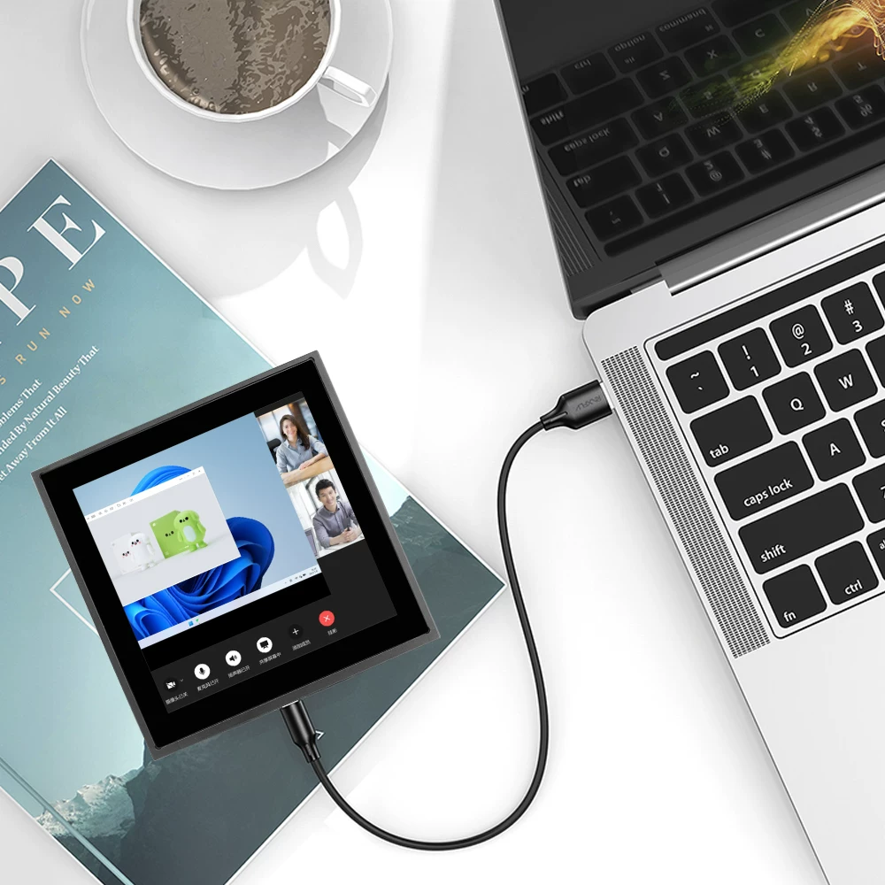
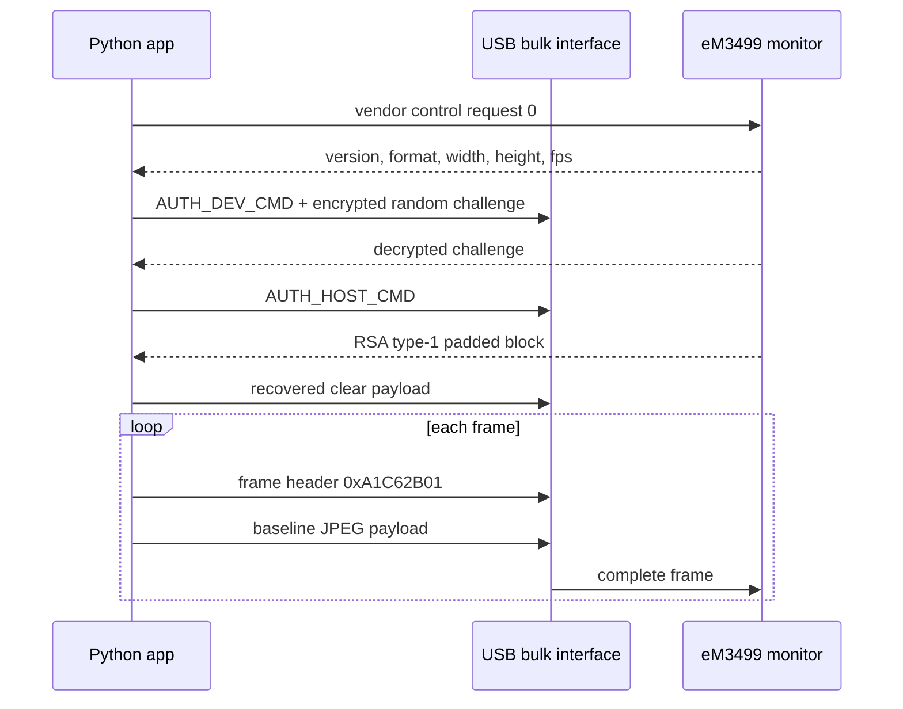

# eM3499-Monitor

Userspace Python driver, protocol notes, and working examples for the ArtInChip
eM3499 USB monitor used in small Waveshare-style USB display modules.



Tested hardware:

```text
Product       eM3499-Monitor
Manufacturer  ArtInChip
Serial        2024123456
VID:PID       33c3:0e02
Resolution    480x480
Media format  JPEG, 0x10
```

Russian documentation: [README.ru.md](README.ru.md)

## What Is Included

- Direct USB display transport over PyUSB.
- RSA authentication handshake recovered from ArtInChip tooling.
- JPEG frame sender with stable encoder defaults.
- HID touch reader with stale-contact filtering.
- Examples for drawing a circle, square, gradient, clock, and touch events.
- Full English and Russian protocol documentation.
- macOS and Linux setup scripts.
- A higher-level information-screen application from the original investigation.

## Quick Start

```bash
git clone git@github.com:xormal/eM3499-Monitor.git
cd eM3499-Monitor
python3 -m venv .venv
source .venv/bin/activate
python -m pip install -e .
python examples/draw_shapes.py --mode all
```

macOS setup:

```bash
bash scripts/macos_setup.sh
```

Linux setup:

```bash
bash scripts/linux_setup.sh
sudo cp scripts/99-artinchip-usb-display.rules /etc/udev/rules.d/
sudo udevadm control --reload-rules
sudo udevadm trigger
```

## Examples

Draw a circle:

```bash
python examples/draw_shapes.py --mode circle
```

Draw a square:

```bash
python examples/draw_shapes.py --mode square
```

Fill the display with a gradient:

```bash
python examples/draw_shapes.py --mode gradient
```

Run a clock:

```bash
python examples/clock.py --duration 60 --fps 1
```

Read touch events:

```bash
python -m em3499_monitor.touch
```

Run the full information screen:

```bash
python apps/info_screen.py --config apps/info_screen.ini
```

## Stable Frame Settings

These settings were stable on the tested firmware:

```text
JPEG quality       60
Pillow subsampling 2
USB chunk size     4096
```

Unsupported JPEG variants can make the display stop updating until the unit is
rebooted or replugged. When probing new encoder settings, start with one frame.

## Architecture


## Frame Flow



## Repository Layout

```text
src/em3499_monitor/        importable driver and touch modules
examples/                  small documented demos
apps/                      working scripts from the investigation
docs/en/                   English protocol documentation
docs/ru/                   Russian protocol documentation
docs/assets/               display photo and asset notes
scripts/                   macOS/Linux setup and udev rule
```

## Documentation

- [English protocol guide](docs/en/protocol.md)
- [Russian protocol guide](docs/ru/protocol.md)
- [Reverse-engineering notes](docs/en/reverse-engineering.md)
- [Touch protocol notes](docs/en/touch.md)

## Notes

This repository documents the direct userspace protocol. It does not include
large vendor packages, binary drivers, extracted archives, or local caches.

The included photo is stored in [docs/assets](docs/assets/README.md) with its
source URL.
