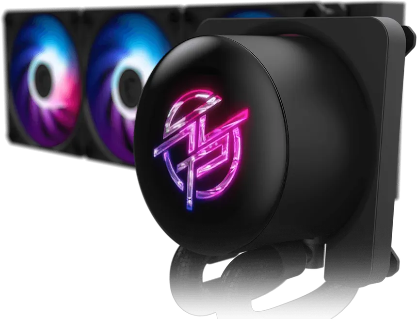

# MSI-P13-Display

Linux userspace driver for the MSI P13 USB display panel (ArtInChip controller).



```text
VID:PID       33c3:0e02
Resolution    480x480
Media format  JPEG, 0x10
FPS           60
```

## Requirements

- Linux with libusb
- `send_image.py` — any desktop session
- `panel_monitor.py` — KDE Plasma Wayland, `krfb`, and system `python3-dbus`

## Quick Start

```bash
git clone git@github.com:xormal/MSI-P13-Display.git
cd MSI-P13-Display
bash scripts/linux_setup.sh
source .venv/bin/activate
sudo cp scripts/99-msi-p13-display.rules /etc/udev/rules.d/
sudo udevadm control --reload-rules && sudo udevadm trigger
python examples/send_image.py photo.jpg
```

## Display driver at login

Install as a systemd user service (starts at graphical login):

```bash
sudo dnf install krfb python3-dbus python3-gobject   # Fedora
./scripts/install-panel-monitor.sh
```

The USB panel appears as `Virtual-MSI-P13` in Display Settings. Drag windows
onto it; frames stream to the panel at up to 60 FPS.

```bash
systemctl --user status msi-p13-panel-monitor.service
journalctl --user -u msi-p13-panel-monitor.service -f
tail -f ~/.local/state/msi-p13-display/panel-monitor.log
```

Remove:

```bash
./scripts/install-panel-monitor.sh --remove
```

Manual run:

```bash
python examples/panel_monitor.py --shell
```

## Send images

```bash
python examples/send_image.py photo.jpg
python examples/send_image.py animation.gif
```

## Stable Frame Settings

```text
JPEG quality       60
Pillow subsampling 2
USB chunk size     4096
```

## Layout

```text
src/msi_p13_display/  display driver, capture, streaming
examples/             panel_monitor.py, send_image.py
docs/en/              protocol guide
scripts/              setup, udev rule, systemd installer
```

## Documentation

- [Protocol guide](docs/en/protocol.md)
