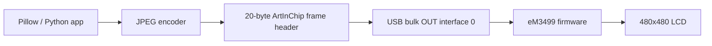
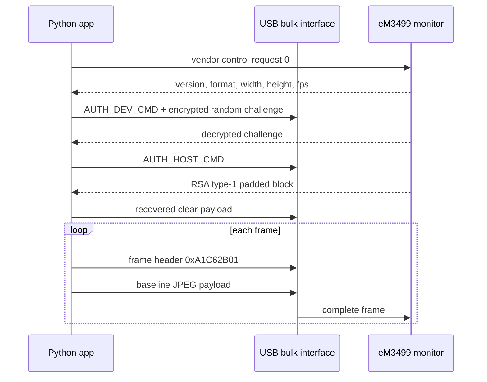

# eM3499-Monitor

Userspace Python-драйвер, описание протокола и рабочие примеры для USB-монитора
ArtInChip eM3499, который используется в небольших Waveshare-style USB-дисплеях.


Проверенное устройство:

```text
Product       eM3499-Monitor
Manufacturer  ArtInChip
Serial        2024123456
VID:PID       33c3:0e02
Resolution    480x480
Media format  JPEG, 0x10
```

Английская документация: [README.md](README.md)

## Что входит в репозиторий

- Прямой USB transport дисплея через PyUSB.
- RSA authentication handshake, восстановленный из ArtInChip tooling.
- Отправка JPEG-кадров со стабильными encoder defaults.
- Примеры для круга, квадрата, градиента, часов и отправки изображений.
- Полная документация протокола на английском и русском.
- Setup-скрипты для macOS и Linux.
- Высокоуровневый информационный экран из исходного исследования.

## Быстрый старт

```bash
git clone git@github.com:xormal/eM3499-Monitor.git
cd eM3499-Monitor
python3 -m venv .venv
source .venv/bin/activate
python -m pip install -e .
python examples/draw_shapes.py --mode all
```

Установка на macOS:

```bash
bash scripts/macos_setup.sh
```

Установка на Linux:

```bash
bash scripts/linux_setup.sh
sudo cp scripts/99-artinchip-usb-display.rules /etc/udev/rules.d/
sudo udevadm control --reload-rules
sudo udevadm trigger
```

## Примеры

Нарисовать круг:

```bash
python examples/draw_shapes.py --mode circle
```

Нарисовать квадрат:

```bash
python examples/draw_shapes.py --mode square
```

Залить дисплей градиентом:

```bash
python examples/draw_shapes.py --mode gradient
```

Запустить часы:

```bash
python examples/clock.py --duration 60 --fps 1
```

Отправить изображение или анимацию:

```bash
python examples/send_image.py photo.jpg
```

Запустить полный информационный экран:

```bash
python apps/info_screen.py --config apps/info_screen.ini
```

## Стабильные настройки кадров

Эти параметры стабильно работали на проверенной прошивке:

```text
JPEG quality       60
Pillow subsampling 2
USB chunk size     4096
```

Неподдерживаемые варианты JPEG могут привести к тому, что дисплей перестанет
обновляться до перезагрузки или переподключения. При проверке новых настроек
сначала отправляйте один кадр.

## Архитектура



## Поток кадра



## Структура

```text
src/em3499_monitor/        импортируемый display driver
examples/                  маленькие документированные demo
apps/                      рабочие скрипты из исследования
docs/en/                   документация протокола на английском
docs/ru/                   документация протокола на русском
docs/assets/               фото дисплея и описание assets
scripts/                   setup для macOS/Linux и udev rule
```

## Документация

- [Английское описание протокола](docs/en/protocol.md)
- [Русское описание протокола](docs/ru/protocol.md)
- [Заметки по реверс-инжинирингу](docs/ru/reverse-engineering.md)

## Примечания

Репозиторий описывает прямой userspace-протокол. Большие vendor-пакеты,
бинарные драйверы, распакованные архивы и локальные caches сюда не включены.

Фото дисплея сохранено в [docs/assets](docs/assets/README.md) с указанием
исходного URL.
