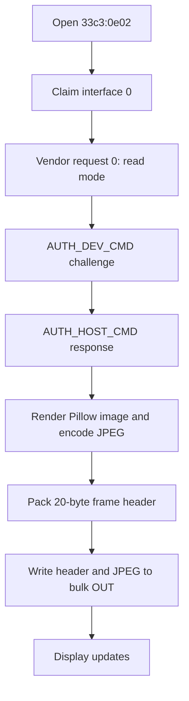

# ArtInChip eM3499 USB Display: Protocol and Userspace Programming Guide

This document describes how to drive the ArtInChip eM3499 USB display directly
from userspace on macOS and Linux without the vendor application. It is based on
the local reverse-engineering work in this repository, the recovered ArtInChip
Linux driver sources, the Waveshare Raspberry Pi package, and live tests against
the connected device.

The same package also contains working Python examples:

- `src/em3499_monitor/display.py` - a small documented userspace display driver.
- `examples/draw_shapes.py` - draw a circle, a square, and a gradient.
- `examples/clock.py` - continuously update a clock.
- `examples/touch_events.py` - read the touch panel HID interface.

## Tested Device

Observed USB identity:

```text
Product       eM3499-Monitor
Manufacturer  ArtInChip
Serial        2024123456
VID:PID       33c3:0e02
Display mode  480x480
Media format  0x10, JPEG
Reported FPS  60
```

The display and touch panel are separate USB interfaces under the same VID/PID.
The display image stream is a vendor bulk interface. The touch panel is a HID
digitizer.

## Installation

### macOS

Use Homebrew for native libraries:

```bash
cd eM3499-Monitor
bash scripts/macos_setup.sh
source .venv/bin/activate
python examples/draw_shapes.py --mode all
```

Manual equivalent:

```bash
brew install libusb hidapi
python3 -m venv .venv
source .venv/bin/activate
python -m pip install -e .
```

macOS usually keeps the HID touch interface under the system HID stack. Read
touch events with `hidapi`; do not claim the HID interface with PyUSB.

### Linux

For Debian, Ubuntu, and Raspberry Pi OS:

```bash
cd eM3499-Monitor
bash scripts/linux_setup.sh
```

For non-root access, install the udev rule:

```bash
sudo cp scripts/99-artinchip-usb-display.rules /etc/udev/rules.d/
sudo udevadm control --reload-rules
sudo udevadm trigger
```

Unplug/replug the display after installing the rule. If access still fails,
test once with `sudo` to separate permission problems from protocol problems.

## Quick Examples

Draw a circle:

```bash
python examples/draw_shapes.py --mode circle
```

Draw a square:

```bash
python examples/draw_shapes.py --mode square
```

Fill the display with a gradient:

```bash
python examples/draw_shapes.py --mode gradient
```

Animate the combined graphics for five frames:

```bash
python examples/draw_shapes.py --mode all --frames 5 --interval 0.5
```

Platform launcher scripts are also provided:

```bash
bash scripts/macos_run_shapes.sh --frames 5
bash scripts/linux_run_shapes.sh --frames 5
```

Run a clock:

```bash
python examples/clock.py --duration 60 --fps 1
```

Read touch events:

```bash
python examples/touch_events.py
```

## Stable Encoder Settings

The firmware accepted these settings reliably during testing:

```text
JPEG quality       60
Pillow subsampling 2   # YUV 4:2:0
USB chunk size     4096
```

Recommended command-line defaults:

```bash
python examples/draw_shapes.py --quality 60 --subsampling 2 --chunk-size 4096
```

Avoid high-risk probing while developing. In early tests, unsupported JPEG
variants could make the display stop updating until reboot. Use one-frame tests
first when changing encoder settings.

## Protocol Overview

The working path is:

1. Open USB device `33c3:0e02`.
2. Claim interface `0`.
3. Find bulk OUT and bulk IN endpoints.
4. Read display parameters with vendor control request `0`.
5. Authenticate with the two RSA commands.
6. Encode each frame as baseline JPEG.
7. Send a 20-byte frame header.
8. Send the JPEG bytes over bulk OUT.



### Device Parameter Request

The display parameters are read with a vendor IN control request:

```text
bmRequestType  0xc0
bRequest       0
wValue         0
wIndex         0
wLength        160
```

The first 16 bytes unpack as eight little-endian `uint16` values:

```c
struct DeviceParams {
    uint16_t version;
    uint16_t chipid;
    uint16_t media_format;
    uint16_t media_bus;
    uint16_t mode_num;
    uint16_t width;
    uint16_t height;
    uint16_t fps;
};
```

The tested unit returned:

```text
version=1 chipid=128 media_format=0x10 width=480 height=480 fps=60
```

### Frame Header

The ArtInChip Linux driver header names the magic values:

```c
#define FRAME_USB_FRAG_HEAD 0x01
#define FRAME_START_MAGIC   (0xA1C62B00 | FRAME_USB_FRAG_HEAD)
```

The userspace frame header is 20 bytes:

```c
struct frame_head {
    uint32_t s_magic;       // 0xA1C62B01
    uint32_t length;        // JPEG payload length in bytes
    uint16_t frame_id;      // rolling frame counter
    uint16_t media_format;  // 0x10 for JPEG
    uint32_t reserve;       // 0
    uint32_t e_magic;       // 0xA1C62B01 for this device
};
```

Python equivalent:

```python
header = struct.pack(
    "<IIHHII",
    0xA1C62B01,
    len(jpeg_bytes),
    frame_id & 0xFFFF,
    0x10,
    0,
    0xA1C62B01,
)
```

After the header, write the complete JPEG payload.

### Authentication

Frames are accepted only after authentication. The recovered sequence is:

```text
AUTH_DEV_CMD   0xA1C62B10
AUTH_HOST_CMD  0xA1C62B11
```

Authentication command packets reuse the 20-byte header shape:

```python
packet = struct.pack("<IIHHII", command, 256, 0, 0, 0, command)
```

Phase 1:

1. Generate a random challenge, length `1..244`.
2. Encrypt it with the recovered RSA public key and PKCS#1 v1.5 padding.
3. Send `AUTH_DEV_CMD`.
4. Send the encrypted 256-byte block.
5. Read 256 bytes from bulk IN.
6. The returned bytes must exactly equal the original challenge.

Phase 2:

1. Send `AUTH_HOST_CMD`.
2. Read a 256-byte RSA type-1 padded block from bulk IN.
3. Recover it with the public exponent and modulus.
4. Validate `00 01 ff ... ff 00`.
5. Send the recovered payload back over bulk OUT.

The complete implementation is in `src/em3499_monitor/display.py`.

## Drawing Pixels

The display protocol does not expose primitive drawing commands. You draw into a
normal image buffer on the host, encode it as JPEG, and send the whole frame.

Minimal circle example:

```python
from PIL import Image, ImageDraw
from em3499_monitor.display import ArtInChipDisplay

display = ArtInChipDisplay(chunk_size=4096)
params = display.open()

img = Image.new("RGB", (params.width, params.height), (8, 11, 18))
draw = ImageDraw.Draw(img)
r = min(params.width, params.height) // 4
cx, cy = params.width // 2, params.height // 2
draw.ellipse((cx - r, cy - r, cx + r, cy + r), fill=(0, 210, 255))

display.send_image(img, frame_id=0, quality=60, subsampling=2)
display.close()
```

Minimal square example:

```python
img = Image.new("RGB", (params.width, params.height), (8, 11, 18))
draw = ImageDraw.Draw(img)
side = min(params.width, params.height) // 2
left = (params.width - side) // 2
top = (params.height - side) // 2
draw.rectangle((left, top, left + side, top + side), fill=(255, 196, 0))
display.send_image(img, frame_id=1, quality=60, subsampling=2)
```

Minimal gradient example:

```python
img = Image.new("RGB", (params.width, params.height))
pixels = img.load()
for y in range(params.height):
    for x in range(params.width):
        t = x / max(1, params.width - 1)
        pixels[x, y] = (int(255 * t), 40, int(255 * (1 - t)))
display.send_image(img, frame_id=2, quality=60, subsampling=2)
```

The ready-to-run version is `examples/draw_shapes.py`.

## Touch Interface

The touch panel appears as HID interface `3`. Observed report layouts:

```text
Report 0x01:
    byte 0       report id, 0x01
    byte 1       status flags
    byte 2       contact id
    bytes 3..4   x_raw, little endian
    bytes 5..6   y_raw, little endian
    last byte    contact count

Report 0x54:
    byte 0       report id, 0x54
    byte 2       status flags
    byte 3       contact id
    bytes 4..5   x_raw, little endian
    bytes 6..7   y_raw, little endian
    last byte    contact count
```

Status flags:

```text
bit 0  Tip Switch
bit 1  In Range
```

The active-contact condition used by the working code is:

```python
pressed = bool(status & 0x01) and contact_count > 0
```

Raw coordinates are scaled from `0..4095` to the current display size:

```python
x = round(x_raw * (width - 1) / 4095)
y = round(y_raw * (height - 1) / 4095)
```

During testing, the capacitive controller could keep sending repeated pressed
reports with unchanged coordinates after the finger was released, especially
after a drag. The example `touch_events.py` includes a small state filter:

- `down` is emitted on the first pressed report.
- `move` is emitted when coordinates change.
- `up reason=up` is emitted on a real inactive report.
- `up reason=stale` is emitted after repeated no-motion pressed reports.
- `up reason=gap` is emitted after repeated empty reads while logically down.

## Reverse-Engineering Notes

The first Waveshare Raspberry Pi package was not enough for direct control on
macOS. Its Python layer calls an ARM64 `monitor.so` library, which is a theme
and serial/system-data wrapper. It exposes functions such as:

```text
Monitor_init
Monitor_SetRootDir
Monitor_download_theme
Monitor_sendSystemData
Monitor_Delete
```

That route uses a separate high-level theme protocol with marker `AA551234` and
serial-like command names. The connected device on macOS did not expose a usable
serial port for that path.

The useful protocol came from the ArtInChip AiCast Linux driver and binary:

- `aic_ud_proto.h` revealed the frame header and magic.
- `artinchip_drm.h` identified `PIXEL_ENCODE_JPEG = 0x10`.
- `aic-render` contained the RSA public key and auth command sequence.
- Live USB tests confirmed interface `0`, bulk OUT/IN endpoints, parameter
  request `0`, and the two auth commands.

The final working approach is therefore a direct userspace USB sender:

```text
Pillow image -> JPEG bytes -> ArtInChip frame header -> USB bulk OUT
```

## Troubleshooting

Device not found:

- Check cable and USB data support.
- Confirm `33c3:0e02` appears in `system_profiler SPUSBDataType` on macOS or
  `lsusb` on Linux.

Permission denied on Linux:

- Install the udev rule from `scripts/99-artinchip-usb-display.rules`.
- Unplug/replug the device.
- Try `sudo python examples/draw_shapes.py --mode circle` once to confirm.

Display authenticates but does not update:

- Use `--quality 60 --subsampling 2 --chunk-size 4096`.
- Try a single frame first.
- Reboot or replug the display if the firmware stopped accepting frames.

Touch does not open:

- Install `hidapi` native libraries.
- On Linux, verify `/dev/hidraw*` permissions.
- On macOS, read through `hidapi`, not PyUSB interface claiming.
