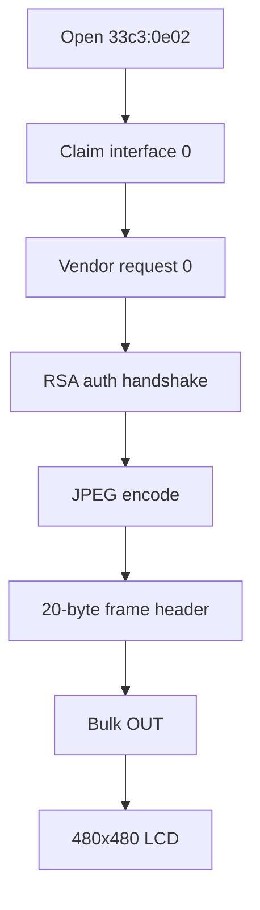

# MSI P13 USB Display Protocol

Linux userspace guide for the MSI P13 USB display panel.

## Components

| Path | Purpose |
| --- | --- |
| `src/msi_p13_display/display.py` | USB driver and JPEG transport |
| `src/msi_p13_display/drm_io.py` | vkms load, kscreen output setup |
| `src/msi_p13_display/capture.py` | vkms DRM framebuffer capture |
| `examples/send_image.py` | Still images, GIF, animated WebP |
| `examples/panel_monitor.py` | KDE compositor monitor streaming |

## Device

```text
VID:PID       33c3:0e02
Resolution    480x480
Media format  0x10 (JPEG)
FPS           60
Interface     0, bulk IN/OUT
```

## Installation

```bash
cd MSI-P13-Display
bash scripts/install.sh
```

`install.sh` installs native system packages (`python3-pillow`, `python3-cryptography`,
`python3-pyusb`, `libdrm`, `kernel-modules-extra` for vkms), loads the vkms DRM module,
the udev rule, and the systemd user service. Unplug and replug the display after install.

```bash
systemctl --user status msi-p13-panel-monitor.service
journalctl --user -u msi-p13-panel-monitor.service -f
```

## Usage

```bash
python3 examples/send_image.py photo.jpg
python3 examples/send_image.py animation.gif
python3 examples/panel_monitor.py --shell
```

`panel_monitor.py` loads the vkms DRM module, enables a virtual output in Display
Settings (for example `Virtual-1`), captures the vkms DRM framebuffer, and streams frames
to the USB panel.

## Encoder Defaults

```text
JPEG quality       60
Pillow subsampling 2
USB chunk size     4096
```

Start with one frame when changing encoder settings. Unsupported JPEG variants
can stop the display until reboot.

## Protocol

The panel uses an ArtInChip USB controller. The working path is:

1. Open USB device `33c3:0e02`.
2. Claim interface `0`.
3. Read parameters with vendor IN request `0`.
4. Authenticate (`AUTH_DEV_CMD`, `AUTH_HOST_CMD`).
5. Send each frame as a 20-byte header plus baseline JPEG over bulk OUT.



### Device parameters

Vendor IN request:

```text
bmRequestType  0xc0
bRequest       0
wLength        160
```

First 16 bytes (eight little-endian `uint16`):

```c
struct DeviceParams {
    uint16_t version, chipid, media_format, media_bus;
    uint16_t mode_num, width, height, fps;
};
```

Tested values: `version=1`, `media_format=0x10`, `480x480`, `fps=60`.

### Frame header

```c
struct frame_head {
    uint32_t s_magic;       // 0xA1C62B01
    uint32_t length;        // JPEG size
    uint16_t frame_id;
    uint16_t media_format;  // 0x10
    uint32_t reserve;       // 0
    uint32_t e_magic;       // 0xA1C62B01
};
```

### Authentication

```text
AUTH_DEV_CMD   0xA1C62B10
AUTH_HOST_CMD  0xA1C62B11
```

Implementation: `src/msi_p13_display/display.py`.

### Sending a frame

```python
from PIL import Image
from msi_p13_display.display import MsiP13Display

display = MsiP13Display(chunk_size=4096)
params = display.open()
img = Image.open("photo.jpg").convert("RGB").resize((params.width, params.height))
display.send_image(img, quality=60, subsampling=2)
display.close()
```

## Troubleshooting

| Problem | Fix |
| --- | --- |
| Device not found | Check cable; confirm `33c3:0e02` in `lsusb` |
| Permission denied | Install udev rule; unplug/replug; try once with `sudo` |
| Auth OK, no image | Use `--quality 60 --subsampling 2 --chunk-size 4096` |
| DRM capture fails | Confirm Virtual-1 is enabled; try `sudo bash scripts/reset-vkms-modes.sh` |
| Stale Virtual-1 modes | `sudo bash scripts/reset-vkms-modes.sh` |
| Driver not starting at login | `systemctl --user status msi-p13-panel-monitor.service` |
