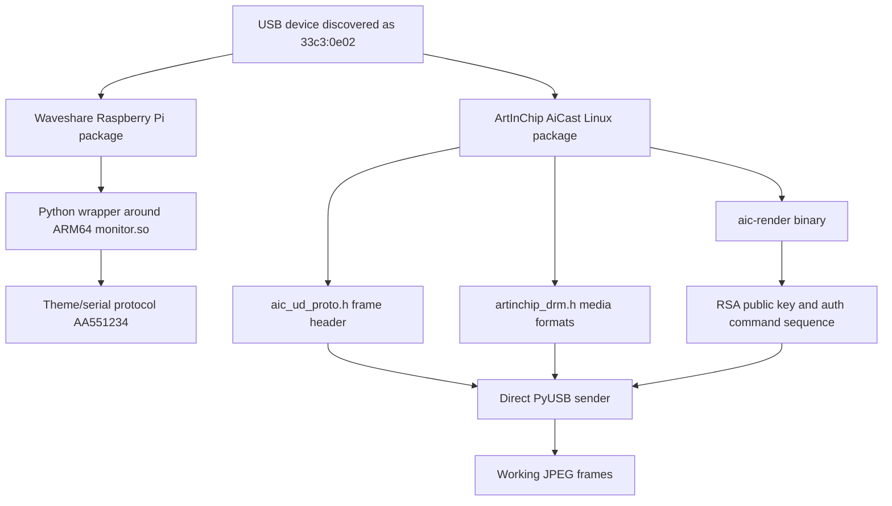

# Reverse-Engineering Notes

This document summarizes how the working userspace protocol was identified.
The full protocol reference is in [protocol.md](protocol.md).

## Investigation Map



## Waveshare Package

The Waveshare Raspberry Pi package includes a Python layer that calls an
ARM64-only `monitor.so` shared library. Exported entry points include:

```text
Monitor_init
Monitor_SetRootDir
Monitor_download_theme
Monitor_sendSystemData
Monitor_Delete
```

That route is useful for understanding vendor UX, but it was not the final
transport for this device on macOS. The theme protocol uses marker `AA551234`
and serial-like commands, while the connected unit exposed the active display
path as vendor USB bulk.

## ArtInChip Driver Sources

The useful low-level pieces came from ArtInChip AiCast Linux materials:

- `aic_ud_proto.h` defined `FRAME_START_MAGIC = 0xA1C62B01`.
- `artinchip_drm.h` identified `PIXEL_ENCODE_JPEG = 0x10`.
- The kernel driver showed the 20-byte frame header shape.
- The `aic-render` binary contained the RSA public key and authentication flow.

## Live USB Validation

The working path was confirmed by live tests:

1. Read device parameters with vendor request `0`.
2. Authenticate with `0xA1C62B10` and `0xA1C62B11`.
3. Send a header with magic `0xA1C62B01`.
4. Send a baseline JPEG payload.

The stable encoder settings were:

```text
quality=60, subsampling=2, chunk_size=4096
```

