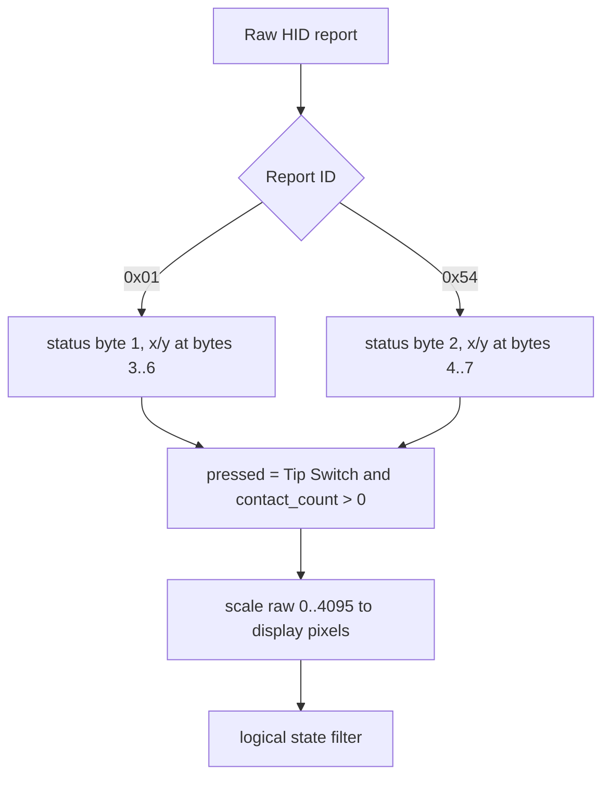
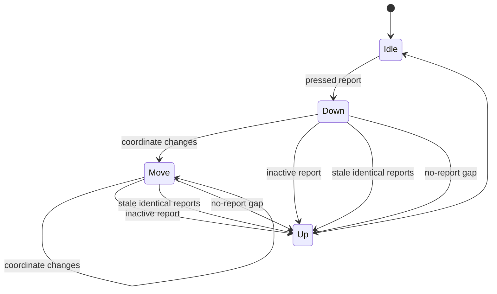

# Touch Protocol Notes

The touch panel is exposed as HID interface `3` on the same USB device.

## Report Parsing



Observed status bits:

```text
bit 0  Tip Switch
bit 1  In Range
```

Coordinate scaling:

```python
x = round(x_raw * (width - 1) / 4095)
y = round(y_raw * (height - 1) / 4095)
```

## Logical Filter

The controller can keep reporting a pressed contact with unchanged coordinates
after the finger is released. The reader therefore emits logical events:



See `src/em3499_monitor/touch.py` for the standalone implementation.
