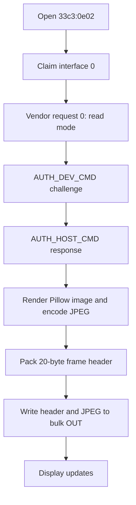

# USB-дисплей ArtInChip eM3499: протокол и руководство по работе из userspace

Этот документ описывает, как напрямую управлять USB-дисплеем ArtInChip eM3499
из userspace на macOS и Linux без vendor-приложения. Описание основано на
локальном реверс-инжиниринге в этом репозитории, найденных исходниках
Linux-драйвера ArtInChip, пакете Waveshare для Raspberry Pi и живых тестах с
подключенным устройством.

В этой папке также есть рабочие Python-примеры:

- `src/em3499_monitor/display.py` - небольшой документированный userspace-драйвер.
- `examples/draw_shapes.py` - рисование круга, квадрата и градиента.
- `examples/clock.py` - постоянное обновление часов.
- `examples/send_image.py` - отправка still-изображений, GIF и animated WebP.

## Проверенное устройство

Наблюдаемая USB-идентификация:

```text
Product       eM3499-Monitor
Manufacturer  ArtInChip
Serial        2024123456
VID:PID       33c3:0e02
Display mode  480x480
Media format  0x10, JPEG
Reported FPS  60
```

Кадры для дисплея отправляются через vendor bulk interface на USB interface `0`.

## Установка

### macOS

Нативные библиотеки удобно поставить через Homebrew:

```bash
cd eM3499-Monitor
bash scripts/macos_setup.sh
source .venv/bin/activate
python examples/draw_shapes.py --mode all
```

То же вручную:

```bash
brew install libusb
python3 -m venv .venv
source .venv/bin/activate
python -m pip install -e .
```

### Linux

Для Debian, Ubuntu и Raspberry Pi OS:

```bash
cd eM3499-Monitor
bash scripts/linux_setup.sh
```

Для доступа без root установите udev-правило:

```bash
sudo cp scripts/99-artinchip-usb-display.rules /etc/udev/rules.d/
sudo udevadm control --reload-rules
sudo udevadm trigger
```

После установки правила отключите и заново подключите дисплей. Если доступ все
еще не работает, один раз запустите пример через `sudo`, чтобы отделить проблему
прав доступа от проблемы протокола.

## Быстрые примеры

Нарисовать круг:

```bash
python examples/draw_shapes.py --mode circle
```

Нарисовать квадрат:

```bash
python examples/draw_shapes.py --mode square
```

Залить дисплей градиентом:

```bash
python examples/draw_shapes.py --mode gradient
```

Показать комбинированную анимацию из пяти кадров:

```bash
python examples/draw_shapes.py --mode all --frames 5 --interval 0.5
```

Также есть platform launcher scripts:

```bash
bash scripts/macos_run_shapes.sh --frames 5
bash scripts/linux_run_shapes.sh --frames 5
```

Запустить часы:

```bash
python examples/clock.py --duration 60 --fps 1
```

Отправить изображение или анимацию:

```bash
python examples/send_image.py photo.jpg
python examples/send_image.py animation.gif
```

## Стабильные настройки кодирования

Во время тестов эти настройки стабильно принимались прошивкой:

```text
JPEG quality       60
Pillow subsampling 2   # YUV 4:2:0
USB chunk size     4096
```

Рекомендуемые параметры командной строки:

```bash
python examples/draw_shapes.py --quality 60 --subsampling 2 --chunk-size 4096
```

Не стоит агрессивно менять JPEG-параметры во время разработки. На ранних тестах
неподдерживаемые варианты JPEG могли приводить к тому, что дисплей переставал
обновляться до перезагрузки. При проверке новых параметров сначала отправляйте
один кадр.

## Обзор протокола

Рабочая последовательность:

1. Открыть USB-устройство `33c3:0e02`.
2. Забрать interface `0`.
3. Найти bulk OUT и bulk IN endpoints.
4. Прочитать параметры дисплея vendor control request `0`.
5. Пройти две RSA-фазы аутентификации.
6. Закодировать каждый кадр как baseline JPEG.
7. Отправить 20-байтный заголовок кадра.
8. Отправить JPEG-байты через bulk OUT.



### Запрос параметров устройства

Параметры дисплея читаются vendor IN control request:

```text
bmRequestType  0xc0
bRequest       0
wValue         0
wIndex         0
wLength        160
```

Первые 16 байт распаковываются как восемь little-endian `uint16`:

```c
struct DeviceParams {
    uint16_t version;
    uint16_t chipid;
    uint16_t media_format;
    uint16_t media_bus;
    uint16_t mode_num;
    uint16_t width;
    uint16_t height;
    uint16_t fps;
};
```

Проверенное устройство вернуло:

```text
version=1 chipid=128 media_format=0x10 width=480 height=480 fps=60
```

### Заголовок кадра

В заголовке Linux-драйвера ArtInChip найдены magic-константы:

```c
#define FRAME_USB_FRAG_HEAD 0x01
#define FRAME_START_MAGIC   (0xA1C62B00 | FRAME_USB_FRAG_HEAD)
```

Userspace-заголовок кадра занимает 20 байт:

```c
struct frame_head {
    uint32_t s_magic;       // 0xA1C62B01
    uint32_t length;        // длина JPEG payload в байтах
    uint16_t frame_id;      // счетчик кадров
    uint16_t media_format;  // 0x10 для JPEG
    uint32_t reserve;       // 0
    uint32_t e_magic;       // 0xA1C62B01 для этого устройства
};
```

Эквивалент на Python:

```python
header = struct.pack(
    "<IIHHII",
    0xA1C62B01,
    len(jpeg_bytes),
    frame_id & 0xFFFF,
    0x10,
    0,
    0xA1C62B01,
)
```

После заголовка отправляется полный JPEG payload.

### Аутентификация

Кадры принимаются только после аутентификации. Восстановленная последовательность:

```text
AUTH_DEV_CMD   0xA1C62B10
AUTH_HOST_CMD  0xA1C62B11
```

Пакеты auth-команд используют ту же форму 20-байтного заголовка:

```python
packet = struct.pack("<IIHHII", command, 256, 0, 0, 0, command)
```

Фаза 1:

1. Сгенерировать случайный challenge длиной `1..244`.
2. Зашифровать его восстановленным RSA public key с PKCS#1 v1.5 padding.
3. Отправить `AUTH_DEV_CMD`.
4. Отправить зашифрованный 256-байтный блок.
5. Прочитать 256 байт из bulk IN.
6. Возвращенные байты должны точно совпасть с исходным challenge.

Фаза 2:

1. Отправить `AUTH_HOST_CMD`.
2. Прочитать 256-байтный RSA type-1 padded block из bulk IN.
3. Восстановить его через public exponent и modulus.
4. Проверить структуру `00 01 ff ... ff 00`.
5. Отправить восстановленный payload обратно через bulk OUT.

Полная реализация находится в `src/em3499_monitor/display.py`.

## Рисование пикселей

Протокол дисплея не содержит команд вроде “нарисуй круг”. Рисование происходит
на стороне host: создается обычный image buffer, он кодируется в JPEG, и весь
кадр отправляется на дисплей.

Минимальный пример с кругом:

```python
from PIL import Image, ImageDraw
from em3499_monitor.display import ArtInChipDisplay

display = ArtInChipDisplay(chunk_size=4096)
params = display.open()

img = Image.new("RGB", (params.width, params.height), (8, 11, 18))
draw = ImageDraw.Draw(img)
r = min(params.width, params.height) // 4
cx, cy = params.width // 2, params.height // 2
draw.ellipse((cx - r, cy - r, cx + r, cy + r), fill=(0, 210, 255))

display.send_image(img, frame_id=0, quality=60, subsampling=2)
display.close()
```

Минимальный пример с квадратом:

```python
img = Image.new("RGB", (params.width, params.height), (8, 11, 18))
draw = ImageDraw.Draw(img)
side = min(params.width, params.height) // 2
left = (params.width - side) // 2
top = (params.height - side) // 2
draw.rectangle((left, top, left + side, top + side), fill=(255, 196, 0))
display.send_image(img, frame_id=1, quality=60, subsampling=2)
```

Минимальный пример с градиентом:

```python
img = Image.new("RGB", (params.width, params.height))
pixels = img.load()
for y in range(params.height):
    for x in range(params.width):
        t = x / max(1, params.width - 1)
        pixels[x, y] = (int(255 * t), 40, int(255 * (1 - t)))
display.send_image(img, frame_id=2, quality=60, subsampling=2)
```

Готовая версия для запуска: `examples/draw_shapes.py`.

## Описание реверс-инжиниринга

Первого пакета Waveshare для Raspberry Pi было недостаточно для прямого
управления на macOS. Его Python-слой вызывает ARM64-библиотеку `monitor.so`,
которая отвечает за темы и serial/system-data wrapper. Она экспортирует функции:

```text
Monitor_init
Monitor_SetRootDir
Monitor_download_theme
Monitor_sendSystemData
Monitor_Delete
```

Этот путь использует отдельный высокоуровневый theme-протокол с маркером
`AA551234` и serial-like command names. На подключенном устройстве в macOS не
было пригодного serial-порта для этого варианта.

Рабочий низкоуровневый протокол был найден через ArtInChip AiCast Linux driver и
binary:

- `aic_ud_proto.h` раскрыл frame header и magic.
- `artinchip_drm.h` подтвердил `PIXEL_ENCODE_JPEG = 0x10`.
- `aic-render` содержал RSA public key и auth command sequence.
- Живые USB-тесты подтвердили interface `0`, bulk OUT/IN endpoints, parameter
  request `0` и две auth-команды.

Итоговый рабочий способ:

```text
Pillow image -> JPEG bytes -> ArtInChip frame header -> USB bulk OUT
```

## Диагностика

Устройство не найдено:

- Проверьте кабель и поддержку USB data.
- Убедитесь, что `33c3:0e02` виден в `system_profiler SPUSBDataType` на macOS
  или в `lsusb` на Linux.

Permission denied на Linux:

- Установите udev-правило из `scripts/99-artinchip-usb-display.rules`.
- Отключите и заново подключите устройство.
- Один раз попробуйте `sudo python examples/draw_shapes.py --mode circle`.

Аутентификация проходит, но экран не обновляется:

- Используйте `--quality 60 --subsampling 2 --chunk-size 4096`.
- Сначала пробуйте один кадр.
- Если прошивка перестала принимать кадры, перезагрузите или переподключите дисплей.
