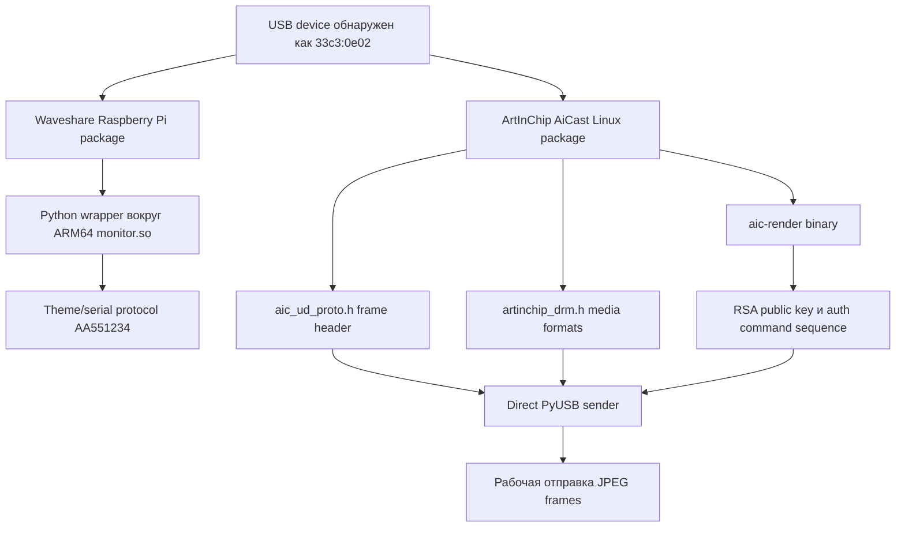

# Заметки по реверс-инжинирингу

Этот документ кратко описывает, как был найден рабочий userspace-протокол.
Полное описание протокола находится в [protocol.md](protocol.md).

## Карта исследования



## Waveshare Package

Пакет Waveshare для Raspberry Pi содержит Python-слой, который вызывает
ARM64-only shared library `monitor.so`. Экспортируемые функции:

```text
Monitor_init
Monitor_SetRootDir
Monitor_download_theme
Monitor_sendSystemData
Monitor_Delete
```

Этот путь полезен для понимания vendor UX, но на macOS он не стал финальным
transport. Theme-протокол использует marker `AA551234` и serial-like commands,
а подключенное устройство показало рабочий путь через vendor USB bulk.

## ArtInChip Driver Sources

Низкоуровневые части были найдены в материалах ArtInChip AiCast Linux:

- `aic_ud_proto.h` определил `FRAME_START_MAGIC = 0xA1C62B01`.
- `artinchip_drm.h` подтвердил `PIXEL_ENCODE_JPEG = 0x10`.
- Kernel driver показал форму 20-байтного frame header.
- Binary `aic-render` содержал RSA public key и authentication flow.

## Проверка на живом USB

Рабочий путь был подтвержден тестами:

1. Прочитать параметры устройства vendor request `0`.
2. Пройти authentication через `0xA1C62B10` и `0xA1C62B11`.
3. Отправить header с magic `0xA1C62B01`.
4. Отправить baseline JPEG payload.

Стабильные настройки encoder:

```text
quality=60, subsampling=2, chunk_size=4096
```

