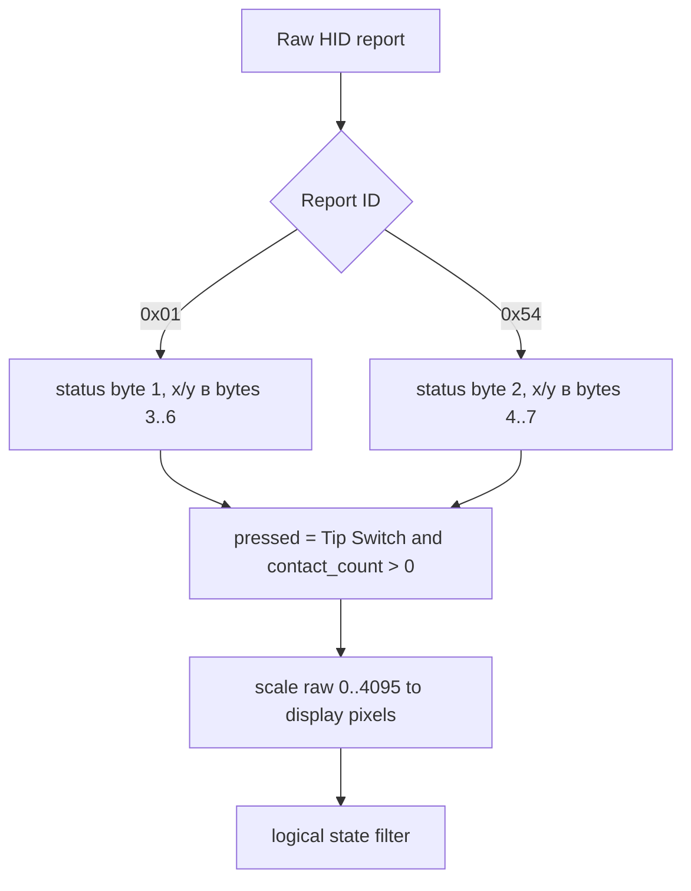
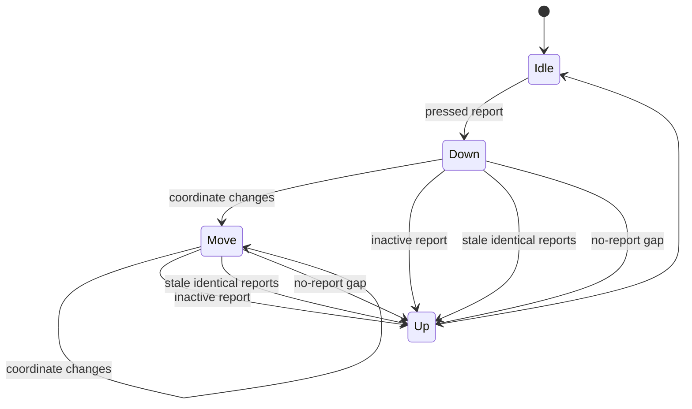

# Заметки по touch-протоколу

Тачскрин виден как HID interface `3` на том же USB-устройстве.

## Разбор report



Наблюдавшиеся status bits:

```text
bit 0  Tip Switch
bit 1  In Range
```

Масштабирование координат:

```python
x = round(x_raw * (width - 1) / 4095)
y = round(y_raw * (height - 1) / 4095)
```

## Logical Filter

Контроллер может продолжать присылать pressed contact с неизменными координатами
после отпускания пальца. Поэтому reader генерирует логические события:



Реализация находится в `src/em3499_monitor/touch.py`.
